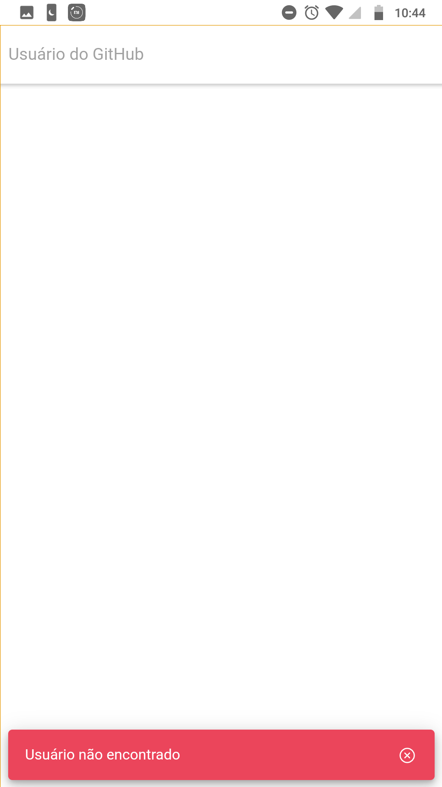
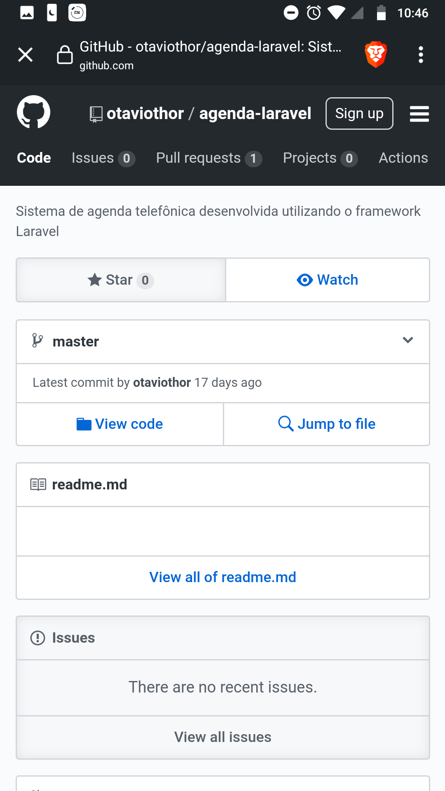

# Repos List - Ionic w/ React

Aplicativo que busca e lista todos os repositórios do usuário pesquisado e quando clicado é redirecionado para a página do repositório com uma WebView desenvolvido com o framework Ionic rodando ReactJS para criação da interface.

  
  

  
  

